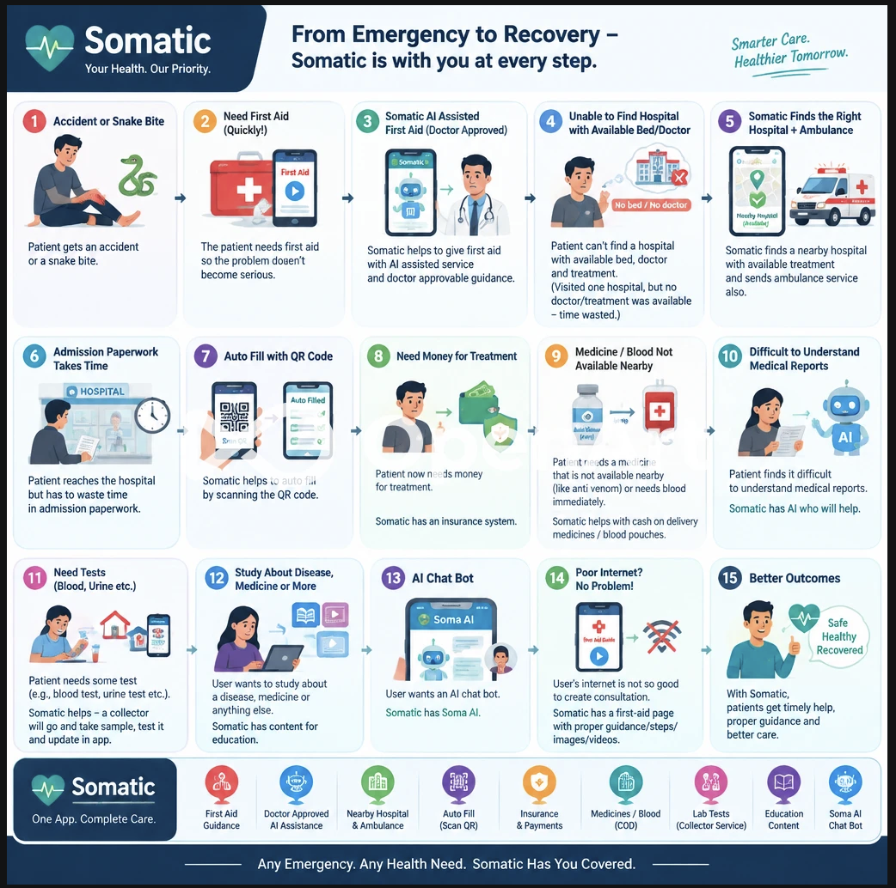

<div align="center">
  

  <h1>SOMATIC</h1>

  <p><strong>AI-Assisted Healthcare Platform</strong></p>

  <p>
    An AI-driven healthcare platform designed to reduce geographical,
    linguistic, administrative, and emergency-response barriers through
    multilingual patient intake, AI-assisted triage, physician review,
    emergency coordination, and connected healthcare services.
  </p>

  <p>
    <strong>Proudly Developed for the Smart India Hackathon</strong>
  </p>

  <br />

  
  
  
  
  
  
  
  
  
</div>

<br />

---

## Overview

SOMATIC is an AI-assisted healthcare platform that connects patients,
doctors, hospitals, dispatchers, ambulances, laboratories, pharmacies,
insurance workflows, and healthcare information services through a
single digital ecosystem.

The platform is designed around a simple principle:

> **AI assists healthcare professionals; qualified professionals remain in control of medical decisions.**

SOMATIC combines:

- Multilingual patient communication
- AI-assisted symptom extraction and triage
- Human-in-the-loop doctor review
- Emergency and SOS workflows
- Department-based case routing
- Ambulance coordination
- Hospital admission assistance
- QR-based patient information retrieval
- Insurance workflows
- Medicine and blood availability workflows
- Lab test booking and sample collection
- Medical report assistance
- Healthcare education
- SOMA AI conversational assistance

The goal is to reduce unnecessary delays caused by language barriers,
manual paperwork, fragmented emergency coordination, and disconnected
healthcare services.

---

## Problem Statement

Healthcare delivery can become difficult when several barriers occur at
the same time.

### 1. Pre-Hospital Knowledge Gap

During emergencies such as accidents, snake bites, or other acute situations,
patients and bystanders may not immediately know what steps to take while
travelling to a healthcare facility.

In rural and remote regions, the distance to an appropriate hospital can
increase the time before professional care becomes available.

SOMATIC provides structured first-aid information for supported emergency
situations while helping users connect with appropriate healthcare resources.

### 2. Linguistic & Administrative Barriers

Patients may describe their symptoms in regional languages or through voice
input, while healthcare professionals may need a standardized clinical view.

Traditional manual intake can also require repetitive documentation and
admission paperwork.

SOMATIC uses multilingual processing and structured digital intake to help
organize patient information before professional review.

### 3. Fragmented Emergency Logistics

Emergency dispatch, ambulance coordination, hospital preparation,
medicines, blood availability, laboratory services, and insurance workflows
can operate independently.

SOMATIC connects these workflows into a single healthcare ecosystem so that
relevant information can move between authorized users and services.

---

# Core Features & End-to-End Flow

## 1. Multilingual Patient Input

Patients can provide information using:

- Text
- Voice
- Supported regional languages
- Images
- Videos
- Medical documents

The system organizes the submitted information into a structured format
for further processing.

---

## 2. AI-Assisted Triage

SOMATIC uses AI to analyze patient-provided information and prepare a
preliminary structured draft.

The system can assist with:

- Symptom extraction
- Chief complaint identification
- AI-generated summary and suggestions
- Ayurvedic insights based on the provided health information
- Preliminary categorization
- Department suggestions
- Emergency keyword detection
- Multilingual translation
- Clinical information organization

AI output is treated as an assistive draft and is always reviewed and
approved by a qualified medical professional before being delivered to
the patient.

---

## 3. Human-in-the-Loop Medical Review

After AI processing, the case can be routed to an appropriate medical
department.

Authorized doctors can:

- Review patient information
- Review AI-generated drafts
- Correct generated information
- Add clinical information
- Approve final instructions
- Provide prescriptions
- Add follow-up recommendations

The final medical decision remains under qualified professional supervision.

---

## 4. Smart Department Routing

SOMATIC can analyze the patient's submitted information and route the case
towards the relevant hospital department.

This reduces unnecessary manual sorting and allows available medical
professionals to access cases from their dashboard.

---

## 5. Zero-Queue Claim System

Available doctors can claim cases from their department queue.

The workflow allows authorized medical staff to:

- View pending cases
- Claim a case
- Review the patient
- Complete the consultation
- Release a case when necessary

Dispatchers can monitor the broader workflow and intervene when additional
coordination is required.

---

## 6. Emergency / SOS Workflow

The platform can identify indicators of potentially critical situations
from submitted patient information.

Cases containing relevant emergency indicators can be marked for priority
review.

This may help medical staff identify potentially urgent cases faster.

The SOS system is an assistive feature and does not replace emergency
services or professional medical assessment.

---

## 7. Doctor Review Interface

Doctors receive a structured view of the consultation containing relevant
patient information and AI-assisted processing results.

The interface can include:

- Patient information
- Chief complaints
- Symptoms
- AI-generated summary and suggestions
- Emergency status
- Department information
- Patient attachments
- Clinical notes
- Prescription tools

A built-in voice reader can also assist doctors in listening to generated
information instead of manually reading the complete draft.

---

## 8. Final Instructions & Reverse Translation

After professional review, approved medical instructions can be delivered
to the patient in their preferred supported language.

Patients can:

- View the final instructions
- Read prescriptions
- Listen to instructions using voice assistance
- Access consultation information through their patient portal

This helps reduce communication gaps between healthcare professionals and
patients.

---

## 9. Hospital Admission with QR

Patients can maintain their relevant information within SOMATIC.

When they reach a supported hospital, the patient can scan the hospital's
SOMATIC QR code to securely send their available information to the
hospital through a POST request.

This helps reduce repetitive data entry during the admission process.

---

## 10. Ambulance Coordination & Emergency Dispatch

SOMATIC provides a dispatcher-led workflow for monitoring emergency
consultations and coordinating ambulance assistance when required.

The dispatcher can monitor consultation cases by their current status,
including pending, in-review, and resolved cases. For cases that have not
yet been claimed, the dispatcher can view the assigned department and
notify the appropriate team. For claimed cases, the dispatcher can view
the available contact details of the assigned doctor.

When ambulance assistance is required, the dispatcher can access the
patient's contact details and contact the patient to confirm their
location and whether ambulance assistance is needed.

The dispatcher then enters the patient's location into SOMATIC, which can
identify nearby hospitals and provide their available contact information.
The dispatcher contacts suitable hospitals to confirm whether the required
treatment is available and coordinates with the appropriate facility to
arrange ambulance assistance.

This workflow helps the dispatcher coordinate communication between the
patient, doctor, hospital, and ambulance service during emergency cases.

## 11. Insurance & Treatment Assistance

SOMATIC includes digital insurance workflows designed to help patients
manage healthcare-related coverage and treatment requirements.

The platform can connect relevant patient information with supported
insurance workflows while reducing repetitive administrative processes.

---

## 12. Medical E-Commerce

SOMATIC includes a healthcare e-commerce ecosystem for supported medical
requirements.

Patients and healthcare facilities can request:

- Medicines
- Emergency healthcare products
- Supported anti-venom products
- Blood units through supported workflows

The platform can support Cash-on-Delivery (COD) based dispatch for eligible
orders.

Product availability and fulfilment depend on participating providers and
real-world inventory.

---

## 13. Lab Tests & Sample Collection

Patients can book supported laboratory tests through SOMATIC.

The workflow can include:

1. Test selection
2. Booking
3. Payment / COD
4. Collection scheduling
5. Home sample collection
6. Sample processing
7. Result entry
8. Report availability

Laboratory results can then be made available through the patient's
healthcare workflow.

---

## 14. Medical Report Assistance

Patients can access supported medical reports through the platform.

SOMATIC can use AI-assisted processing to help users understand complex
medical information in a simpler format.

AI-generated explanations are informational and should not replace
interpretation by a qualified healthcare professional.

---

## 15. Healthcare Education & SOMA AI

SOMATIC also provides educational healthcare resources through:

- Health articles
- Disease information
- Medicine information
- First-aid guidance
- Healthcare learning content
- SOMA AI conversational assistance

The objective is to make reliable healthcare information easier to access
and understand.

---

# Complete Healthcare Journey

The following visual represents the broader SOMATIC healthcare ecosystem,
from emergency situations and first-aid assistance to hospital coordination,
insurance, medicines, laboratory services, healthcare education, and SOMA AI.

<div align="center">
  
</div>

<br/>

The platform connects these services into a continuous healthcare workflow:

```text
Patient Need
    ↓
Digital Patient Input
    ↓
AI-Assisted Processing
    ↓
Human Medical Review
    ↓
Healthcare Service Coordination
    ↓
Treatment / Support / Follow-up
```

---

# Impact & Target Audience

## Patients

### Pre-Hospital Guidance

Access structured first-aid information for supported emergency situations
while seeking professional medical care.

### Remote Healthcare Access

Connect with healthcare professionals through a digital consultation
workflow without requiring physical travel for every interaction.

### Multilingual Communication

Submit symptoms using supported regional languages, voice, text, and
supported media.

### Digital Health Records

Maintain consultation information, prescriptions, reports, and other
supported healthcare information digitally.

### Connected Healthcare Services

Access supported services such as:

- Lab tests
- Medicines
- Blood availability
- Insurance
- Medical reports
- First aid
- Healthcare education

---

## Medical Professionals

### AI-Assisted Workflow

Reduce repetitive documentation and preliminary information processing.

### Structured Patient Information

Review patient information through a standardized digital interface.

### Remote Case Management

Claim and manage consultation cases through the doctor dashboard.

### Human-in-the-Loop Control

Review, modify, and approve AI-generated drafts before final medical
instructions are delivered.

### Emergency Visibility

Identify cases that have been flagged for potential emergency indicators.

---

## Hospitals & Emergency Teams

### Digital Admission

Reduce repetitive information entry using supported QR-based workflows.

### Emergency Preparation

Receive available patient and emergency information.

### Ambulance Coordination

Coordinate supported ambulance requests through the dispatcher workflow.

### Healthcare Logistics

Connect supported hospital workflows with medicines, blood, laboratory,
and other healthcare services.

---

# Technology Stack

## Frontend

- Next.js 16
- React 19
- TypeScript
- Tailwind CSS 4
- React Hook Form
- Zustand
- React Markdown
- Lucide React

## Backend

- Next.js API Routes
- Node.js
- Python
- FastAPI

## Database

- MongoDB
- Mongoose

## Authentication & Infrastructure

- NextAuth
- Role-Based Access Control (RBAC)
- Upstash Redis
- Rate limiting
- System audit logging

## Healthcare & Application Utilities

- Razorpay
- QR Code generation and scanning
- PDF generation
- HTML-to-canvas document/image processing
- Form validation
- Toast notifications

---

# Installation & Setup

## 1. Clone the Repository

```bash
git clone https://github.com/Abhisek-Dash-Official/somatic.git
cd somatic
```

---

## 2. Start the Web Application

Open a terminal and navigate to the web application:

```bash
cd web
npm install
npm run dev
```

The frontend will run at:

```text
http://localhost:3000
```

---

## 3. Start the Python Backend

Open a separate terminal:

```bash
cd pyBackend
```

Create a virtual environment:

```bash
python -m venv venv
```

Activate it on Windows:

```bash
venv\Scripts\activate
```

Activate it on macOS/Linux:

```bash
source venv/bin/activate
```

Install dependencies:

```bash
pip install -r requirements.txt
```

Start the FastAPI server:

```bash
uvicorn main:app --reload
```

The backend will run at:

```text
http://localhost:8000
```

---

# Environment Variables

SOMATIC uses environment variables for database access, authentication,
AI services, payment processing, internal communication, rate limiting,
and application configuration.

Never commit real `.env` files, API keys, database credentials, payment
secrets, or authentication secrets to the repository.

## Web Application

Create a `.env` file inside the `web/` directory:

```env
NEXT_PUBLIC_APP_URL=http://localhost:3000

NEXTAUTH_SECRET=your_nextauth_secret
NEXTAUTH_URL=http://localhost:3000

MONGODB_URI=your_mongodb_connection_string

UPSTASH_REDIS_REST_URL=https://your-upstash-endpoint.upstash.io
UPSTASH_REDIS_REST_TOKEN=your_upstash_redis_token

PYTHON_BACKEND_URL=http://localhost:8000

FREE_CONSULTATION_TOKEN_LIMIT=10000

INTERNAL_API_SECRET=your_internal_api_secret

RAZORPAY_KEY_ID=your_razorpay_key_id
RAZORPAY_KEY_SECRET=your_razorpay_key_secret

NEXT_PUBLIC_VAPID_PUBLIC_KEY=your_vapid_public_key
VAPID_PUBLIC_KEY=your_vapid_public_key
VAPID_PRIVATE_KEY=your_vapid_private_key
VAPID_SUBJECT=mailto:your-email@example.com
```

## Python / FastAPI Backend

Create a `.env` file inside the `pyBackend/` directory:

```env
GROQ_API_KEY=your_groq_api_key
NEXT_PUBLIC_APP_URL=http://localhost:3000
INTERNAL_API_SECRET=your_internal_api_secret
```

## Environment Variable Reference

| Variable                        | Location           | Purpose                                                     |
| ------------------------------- | ------------------ | ----------------------------------------------------------- |
| `NEXT_PUBLIC_APP_URL`           | `web`, `pyBackend` | Base URL of the web application                             |
| `NEXTAUTH_SECRET`               | `web`              | Secret used by NextAuth                                     |
| `NEXTAUTH_URL`                  | `web`              | Application URL used by NextAuth                            |
| `MONGODB_URI`                   | `web`              | MongoDB database connection                                 |
| `UPSTASH_REDIS_REST_URL`        | `web`              | Upstash Redis endpoint                                      |
| `UPSTASH_REDIS_REST_TOKEN`      | `web`              | Upstash Redis authentication                                |
| `PYTHON_BACKEND_URL`            | `web`              | FastAPI backend URL                                         |
| `FREE_CONSULTATION_TOKEN_LIMIT` | `web`              | Token allowance for free consultation workflows             |
| `INTERNAL_API_SECRET`           | `web`, `pyBackend` | Internal service authentication                             |
| `RAZORPAY_KEY_ID`               | `web`              | Razorpay payment gateway key                                |
| `RAZORPAY_KEY_SECRET`           | `web`              | Razorpay payment gateway secret                             |
| `GROQ_API_KEY`                  | `pyBackend`        | Groq API authentication                                     |
| `NEXT_PUBLIC_VAPID_PUBLIC_KEY`  | `web`              | Public VAPID key used by the browser for push subscriptions |
| `VAPID_PUBLIC_KEY`              | `web`              | Public VAPID key used by the server for Web Push            |
| `VAPID_PRIVATE_KEY`             | `web`              | Private VAPID key used to authenticate Web Push requests    |
| `VAPID_SUBJECT`                 | `web`              | VAPID contact/identity used by the Web Push service         |

---

# Security

SOMATIC is designed with multiple layers of access control and security
controls.

Key mechanisms include:

- Role-Based Access Control
- Authenticated API access
- Protected patient records
- Department-level workflow separation
- Internal backend authentication
- Rate limiting
- System activity logging
- Secure session handling
- Environment-based secret management

Sensitive credentials and production secrets should never be committed to
source control.

---

# Human-in-the-Loop AI

SOMATIC follows a Human-in-the-Loop approach.

AI is used to assist with:

- Information extraction
- Translation
- Patient case organization
- AI-generated summary and suggestions
- Preliminary triage
- Draft generation
- Healthcare information explanation

Qualified healthcare professionals remain responsible for reviewing and
approving clinical decisions and final medical instructions.

AI-generated information can contain errors and should be reviewed before
being used for clinical decision-making.

---

# Responsible Healthcare Use

SOMATIC is designed as a healthcare technology platform and should not be
treated as a replacement for emergency services or qualified medical
professionals.

In a life-threatening emergency, users should immediately contact their
local emergency services or visit the nearest appropriate healthcare
facility.

AI-generated content should not be used as the sole basis for diagnosis,
treatment, medication changes, or other critical medical decisions.

---

# Documentation

Additional project documentation is maintained inside the repository.

### Architecture

- [Database Architecture & Mind Map](./docs/assets/db-mindmap.pdf)
- [Application Flowchart](./docs/assets/flowchart.pdf)
- [ER Diagram](./docs/assets/er-diagram.pdf)

### API Documentation

- [API Endpoints & Payloads](./docs/api-endpoints.md)

### Screenshots

- [Application Screenshots](./docs/screenshots.md)

These documents provide additional information about the database,
application workflows, APIs, and major user interfaces.

---

# Project Status

SOMATIC is an actively developed healthcare technology project.

The platform continues to evolve across:

- AI-assisted healthcare workflows
- Patient consultations
- Emergency coordination
- Ambulance services
- Laboratory services
- Healthcare e-commerce
- Insurance workflows
- Medical reports
- Healthcare education
- SOMA AI

Features and workflows may change as the platform continues to be
developed and tested.

---

# License

This project is licensed under the MIT License.

---

<div align="center">

<strong>Developed for the Smart India Hackathon</strong>

<br/>
<br/>

  <p>
    SOMATIC — One App. Complete Care.
  </p>

</div>
